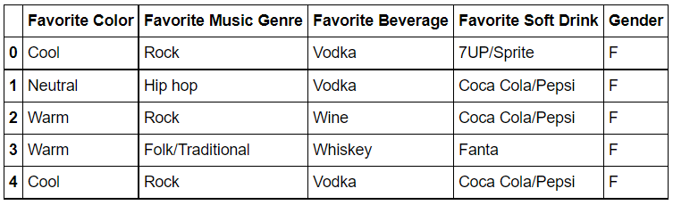
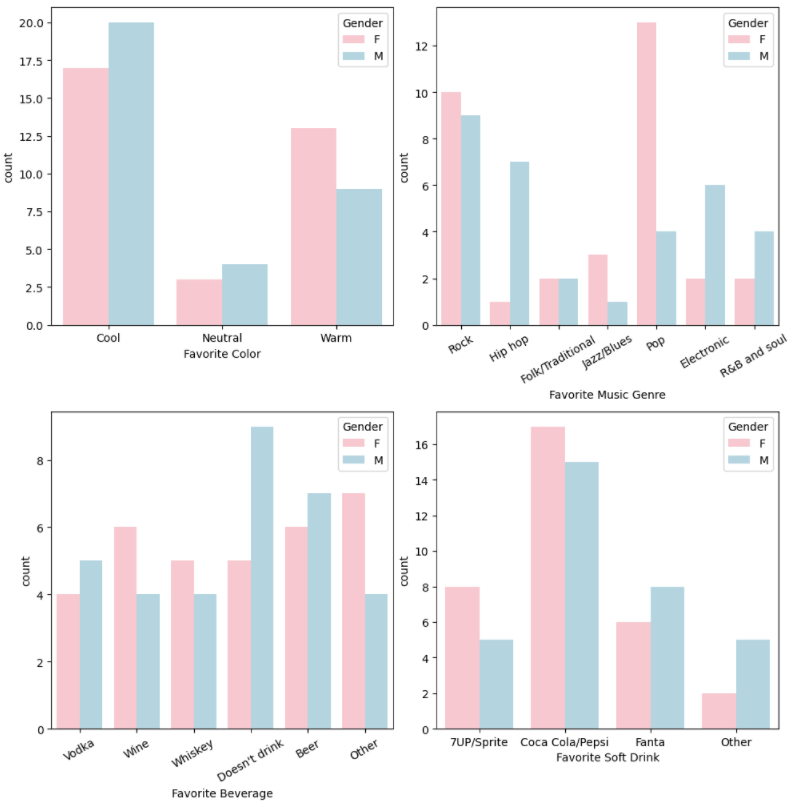
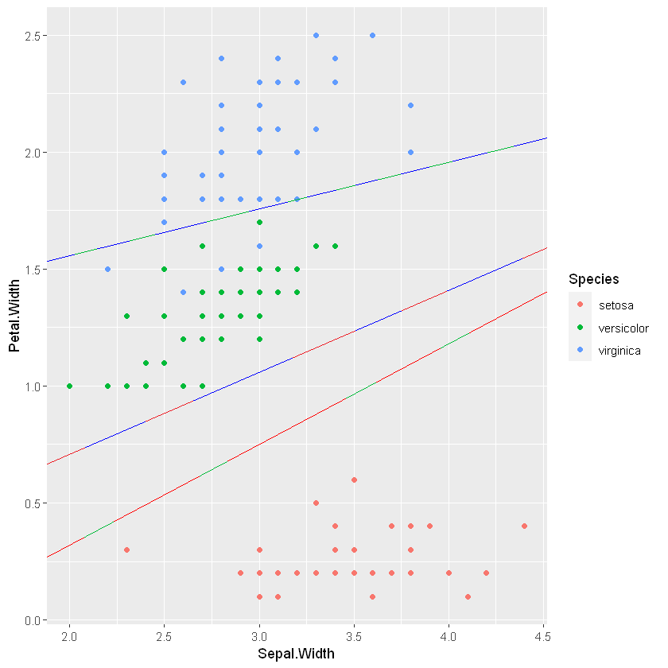
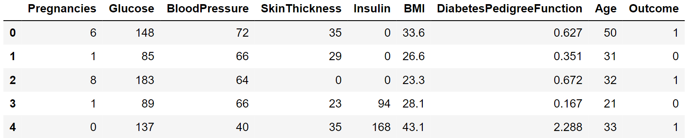
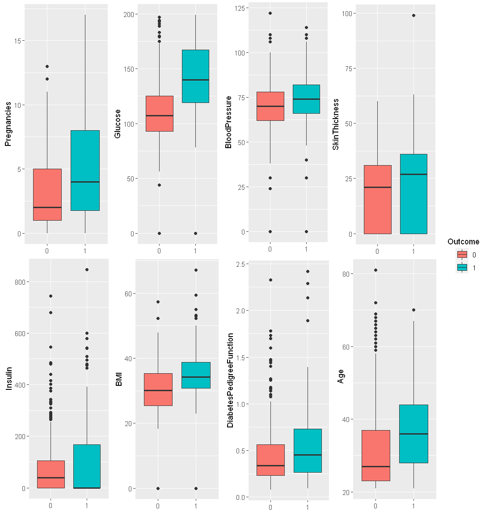

# Clasificación

Este repositorio contiene varios proyectos que resuelven problemas de clasificación 

## Clasificación de Género

Es un proyecto que desarrollé para poder entrenar mis habilidades utilizando algoritmos de clasificación. Dado un conjunto de datos como: gustos musicales o de bebida se intenta clasificar a las personas en hombres o mujeres.

Contiene una implementación de un modelo de Árbol de decisión construido utilizando el criterio de Gini y también una implementación de un modelo clasificador de Naive Bayes construido utilizando estadística Bayesiana. Comparé los resultados arrojados por mis modelos con aquellos que obtuve utilizando la librería Sci-Kit Learn.

Librerías utilizadas:

* Numpy
* Pandas
* Matplotlib
* Seaborn
* Sci-kit learn

#### Set de datos

#### Análisis

## Clasificación de Flores

Como parte del curso de Posgrado Aprendizaje Estadístico, desarrollé clasificadores de LDA y QDA con un riguroso análisis estadístico fundamentado en el informe presente en el repositorio. Se utilizó el famoso dataset IRIS. El trabajo se desarrolló en R. 

Las métricas son obtenidas utilizando cross validation. 

A lo largo del trabajo busqué las fronteras de decisión lineal y cuadrática que generan los clasificadores.

#### Frontera lineal

## Clasificación de Diabetes

Como parte del curso de Posgrado Aprendizaje Estadístico, implementé varios clasificadores para hallar la mejor forma de clasificar a personas en diabéticas o no diabéticas a partir de métricas médicas como el índice de masa corporal, edad y glucosa en sangre. En particular desarrollé un ensamble: Bagging. Este trabajo se desarrolló tanto en R como en Python utilizando jupyter notebooks.

En particular se compara el espacio de decisión generado por los distintos métodos.

#### Set de datos

#### Boxplots

